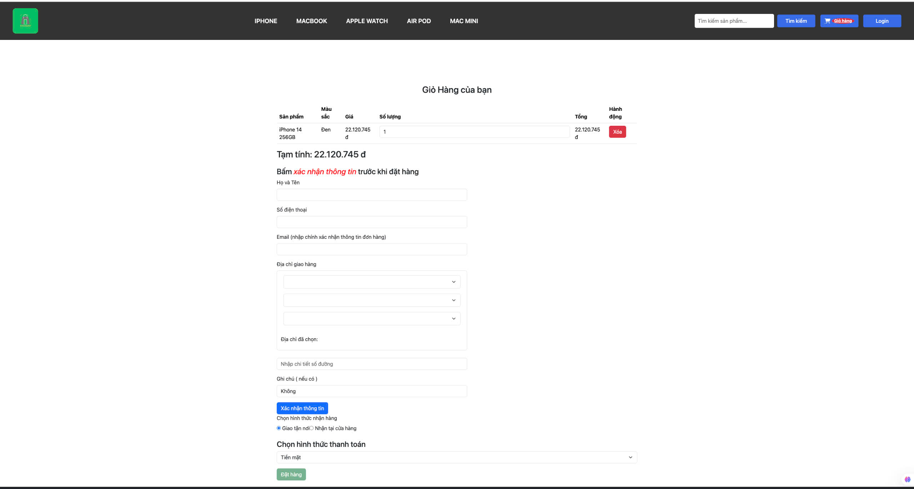
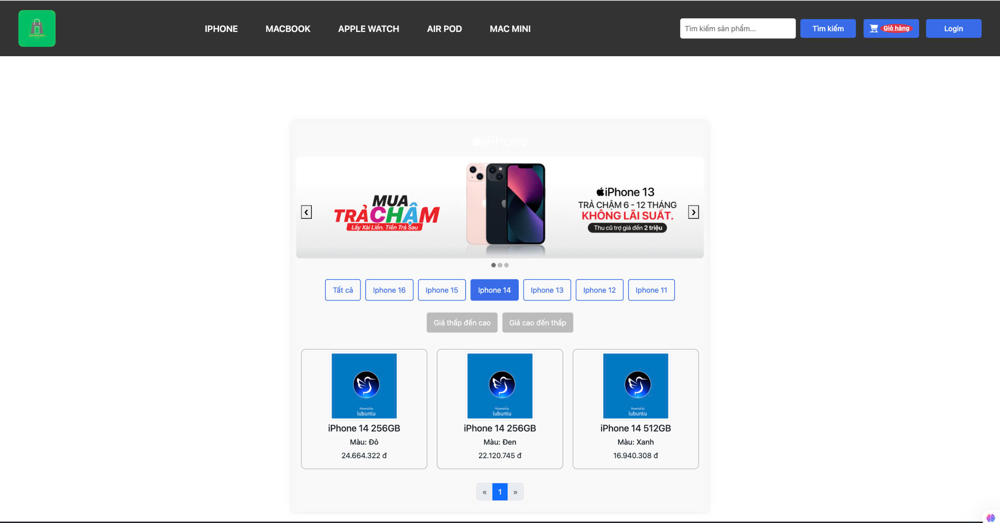
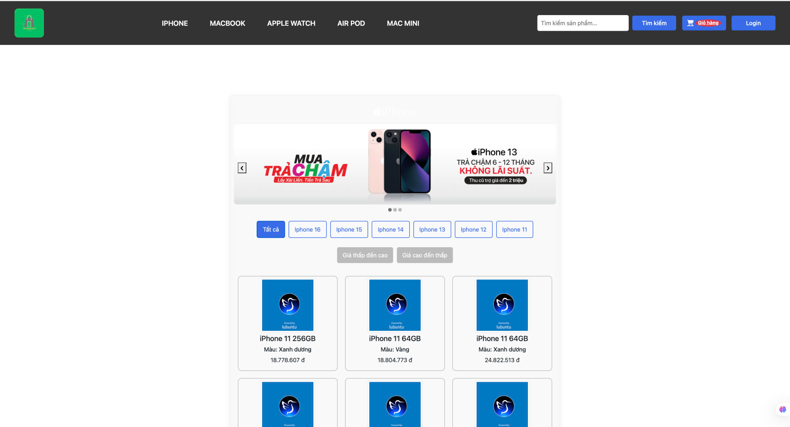
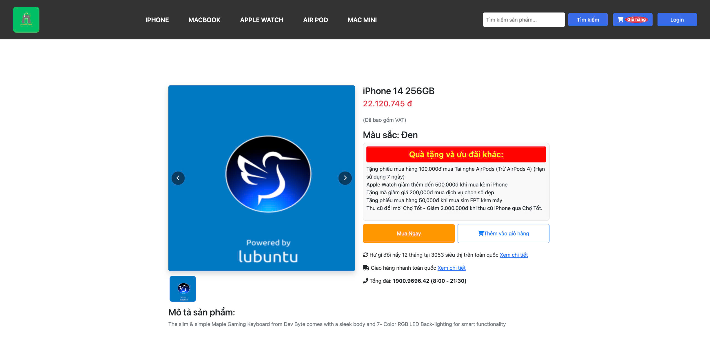
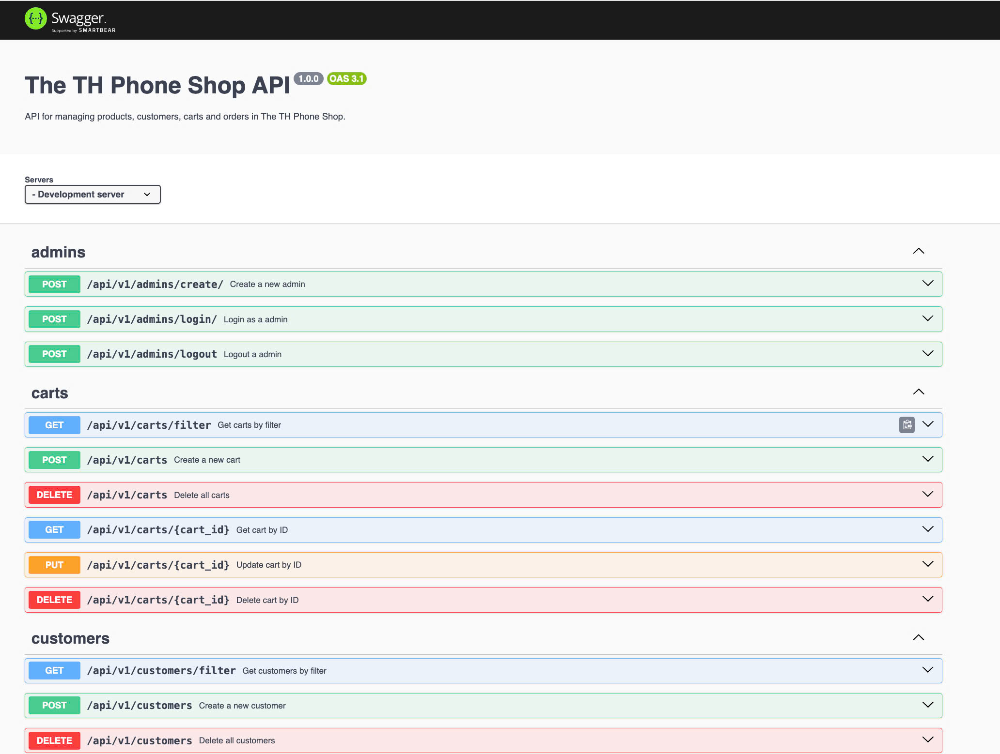
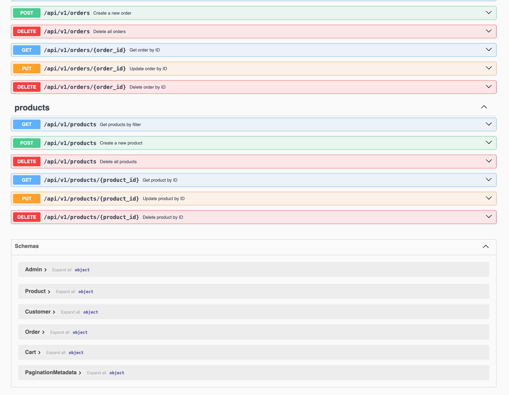

# 📱 Phone Store

**Phone Store** is a full-stack e-commerce web application that allows users to browse, search, and purchase mobile phones. The system includes two main components:

- `frontend`: A user interface built with Vue.js
- `backend-api`: A RESTful API built with Node.js and Express, connected to MongoDB and documented with Swagger

---

## 🧩 Project Structure

Phone-Store/ 
- ├── backend-api/ # Backend source code (Node.js + Express + MongoDB)
- ├── frontend/ # Frontend source code (Vue.js)
- └── README.md # Project documentation

---

## 🌐 Frontend (Vue.js)

### 📄 Description

The frontend of Phone Store is developed using Vue.js. It provides a responsive and user-friendly interface for browsing phones, viewing product details, managing cart items, and handling user authentication.

### 🔧 Technologies Used

- Vue.js 2
- Vue Router
- Vuex
- Axios
- Bootstrap / CSS

### 🚀 Features

- Product listing and detail view
- User authentication (Login/Register)
- Cart management (Add/Remove/Update quantity)
- Product filtering and search
- Admin features for managing products

### 📦 Setup
- configure your .env file
- after that:
```bash
cd frontend
npm install
npm run dev
```


## 🛠️ Backend API (Node.js + Express)

### 📄 Description
The backend of Phone Store is a RESTful API developed with Node.js and Express. It manages product data, user authentication using JWT, and stores data in a MongoDB database.

### 🔧 Technologies Used
- Node.js
- Express.js
- MongoDB + Mongoose
- JWT (JSON Web Tokens)
- Swagger UI

### 🚀 Features
- CRUD operations for products
- User registration and login
- JWT-based authentication
- RESTful API structure
- Order and cart processing
- Swagger documentation for all API routes

### 📷 Screenshots
<p align="center">
  
  
  
  
</p>

### 📦 Setup
- configure your .env file, add YOUR_SENDGRID_API_KEY
- run backend-api/ct313h_projects.sql at your local database platforms
- after that:
  
```bash
cd backend-api

npx knex seed:run --specific=1_products_seed.js
npx knex seed:run --specific=2_customers_seed.js
npx knex seed:run --specific=3_orders_seed.js
npx knex seed:run --specific=4_carts_seed.js
 
npm install
npm run dev
```

- After starting the backend server, access the Swagger UI at: http://localhost:3300/api-docs
<p align="center">
  
  
</p>


